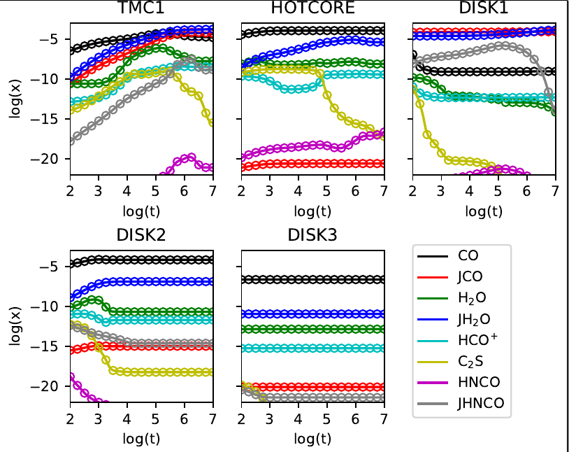

# Introduction:

GGCHEMPY: Gas-Grain CHEMical code for interstellar medium in Python3.

Author: Jixing Ge

E-mail: gejixing666@gmail.com

# Required Python Verion: 
    > Python 3.0

# Required packages:
    numba
    numpy
    scipy
    matplotlib
    progressbar
    pyfiglet (optional)   -> to create ASCII art text of "GGCHEM"

# Usage:
    <1> install GGCHEM:
    python setup.py build
    python setup.py install
    <2> Prepare your input files. See (2).
    <3> Run models. 

  
    See more in examples.py. 
# Benchmark with the five models of Semenov et al., (2010):

***Solid line***: GGCHEMPY

***Points***: model of Semenov et al., (2010).

# References:
    <1> for basic rate equation method:
    Hasegawa T. I., Herbst E., Leung C. M., 1992, ApJS, 82, 167
    Semenov D., et al., 2010, A&A, 522, A42
    
    <2> for reactive desorption:
    Garrod R. T., Wakelam V., Herbst E., 2007, A&A, 467, 1103
    Minissale M., Dulieu F., Cazaux S., Hocuk S., 2016, A&A, 585, A24
    
    <3> for GGCHEM in Fortran:
    Ge J. X., He J. H., Yan H. R., 2016, MNRAS, 455, 3570
    Ge J. X., He J. H., Li A., 2016, MNRAS, 460, L50
    Ge J., Mardones D., Inostroza N., Peng Y., 2020, MNRAS, 497, 3306
    Ge J. X., et al., 2020, ApJ, 891, 36

    <4> for reaction network:
    Semenov D., et al., 2010, A&A, 522, A42
    [KIDA database:](http://kida.astrophy.u-bordeaux.fr/)
    [UDFA database:](http://udfa.ajmarkwick.net/)
