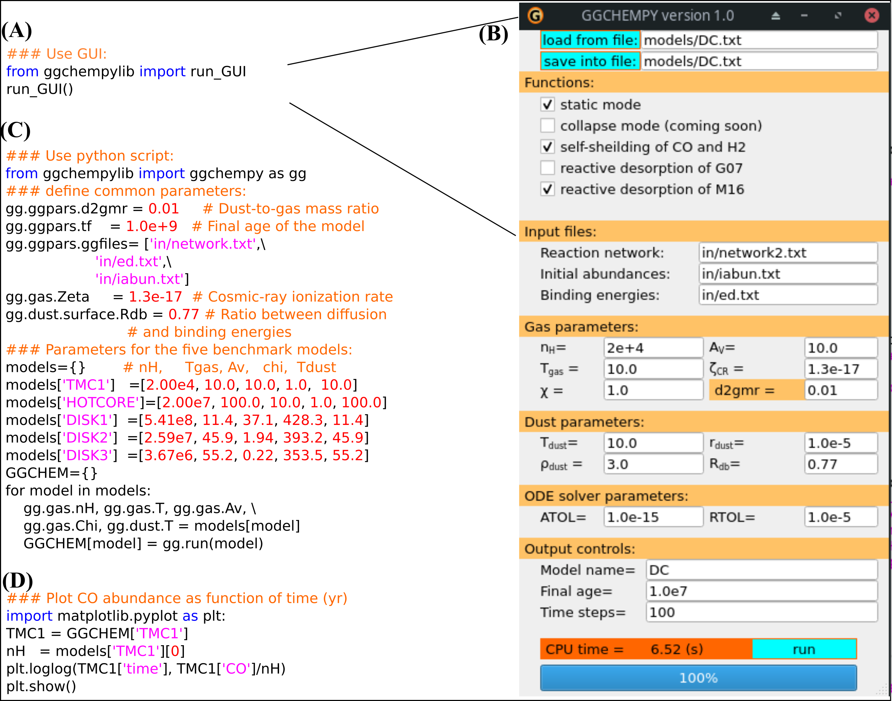

# Introduction:

GGCHEMPY: Gas-Grain CHEMical code for interstellar medium in Python3.

Author: Jixing Ge

E-mail: gejixing666@gmail.com


# Required Python Verion: 
    > Python 3.0

# Required packages:
    numba
    numpy
    scipy
    matplotlib
    progressbar
    platform
    pyqt5                 -> for using GUI
    networkx              -> for using Analysis_tool.py in GUI
    pyfiglet (optional)   -> to create ASCII art text of "GGCHEM"


# Usage:
    <1> install GGCHEM:
    python setup.py build
    python setup.py install
    <2> Prepare your models.
    <3> Run models. 
    
For example, please type the following command on your terminal:
```
Python benchmark.py
```


# Analysis tool
Analysis_tool.py provides a GUI to analyze a given species at a age. See GIF.

Feature: each species in the textlist is clickable to be analyzed.

Just type "python Analysis_tool.py" on your termical and press "ENTER" to use it.


# Benchmark with the five models of Semenov et al., (2010):


***Solid line***: GGCHEMPY

***Point***: model of Semenov et al., (2010).


# CPU times (s):


# Note:
There is a file "in/network2.txt" with updated reactions of HNCO.

Reactive desorption is only available for this updated reaction network since that 
enthalpies taken from KIDA database were only added to it.

# For citing GGCHEMPY:

https://iopscience.iop.org/article/10.1088/1674-4527/ac321e

https://ui.adsabs.harvard.edu/abs/2021arXiv211011117G/abstract

***The bibtex***

@article{Ge_2022,
	doi = {10.1088/1674-4527/ac321e},
	url = {https://doi.org/10.1088/1674-4527/ac321e},
	year = 2022,
	month = {jan},
	publisher = {{IOP} Publishing},
	volume = {22},
	number = {1},
	pages = {015004},
	author = {Jixing Ge},
	title = {{GGCHEMPY}: A Pure Python-based Gas-grain Chemical Code for Efficient Simulation of Interstellar Chemistry{\ast}},
	journal = {Research in Astronomy and Astrophysics},
	abstract = {In this paper, we present a new gas-grain chemical code for interstellar clouds written in pure Python (GGCHEMPY (GGCHEMPY is available on https://github.com/JixingGE/GGCHEMPY)). By combining with the high-performance Python compiler Numba, GGCHEMPY is as efficient as the Fortran-based version. With the Python features, flexible computational workflows and extensions become possible. As a showcase, GGCHEMPY is applied to study the general effects of three-dimensional projection on molecular distributions using a two-core system which can be easily extended for more complex cases. By comparing the molecular distribution differences between two overlapping cores and two merging cores, we summarized the typical chemical differences such as N2H+, HC3N, C2S, H2CO, and C2H, which can be used to interpret 3D structures in molecular clouds.}
}


# References:
    <1> for basic rate equation method:
    Hasegawa T. I., Herbst E., Leung C. M., 1992, ApJS, 82, 167
    Semenov D., et al., 2010, A&A, 522, A42
    
    <2> for reactive desorption:
    Garrod R. T., Wakelam V., Herbst E., 2007, A&A, 467, 1103
    Minissale M., Dulieu F., Cazaux S., Hocuk S., 2016, A&A, 585, A24
    
    <3> for GGCHEM in Fortran:
    Ge J. X., He J. H., Yan H. R., 2016, MNRAS, 455, 3570
    Ge J. X., He J. H., Li A., 2016, MNRAS, 460, L50
    Ge J., Mardones D., Inostroza N., Peng Y., 2020, MNRAS, 497, 3306
    Ge J. X., et al., 2020, ApJ, 891, 36

    <4> for reaction network and benchmark:
    Semenov D., et al., 2010, A&A, 522, A42
    
# Acknowledgements

This work is accomplished with the support from the Chinese Academy of Sciences
(CAS) through a Postdoctoral Fellowship administered by the CAS South America Center for Astronomy
(CASSACA) in Santiago, Chile. 

Jixing  thanks Dr. Jinhua He and Dr. Tie Liu for their constructive suggestions
on improving the code and the paper

# Links:
[KIDA database](http://kida.astrophy.u-bordeaux.fr/)
  
[UDFA database](http://udfa.ajmarkwick.net/)

[GitFront page](https://gitfront.io/r/Jixing-Ge/7b3c064da2aa89e7c1d34633a426340610338338/ggchempy/)
